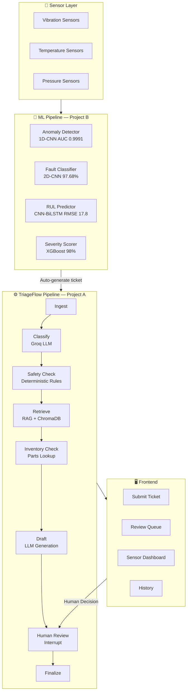
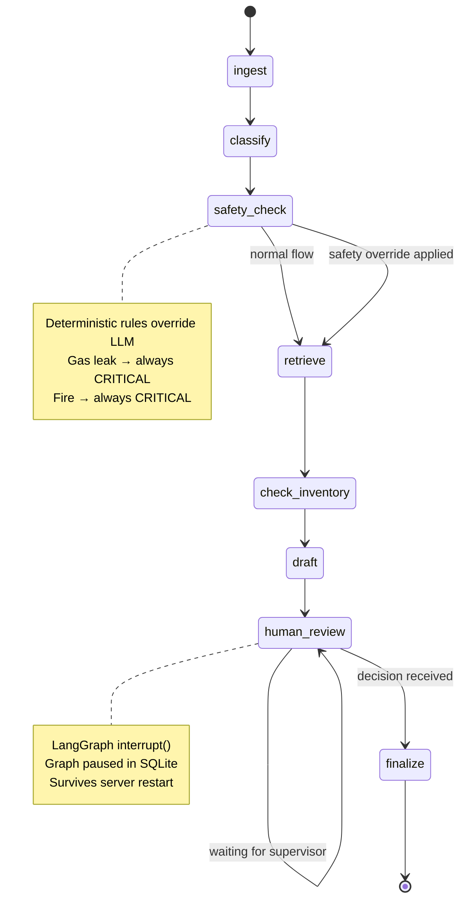
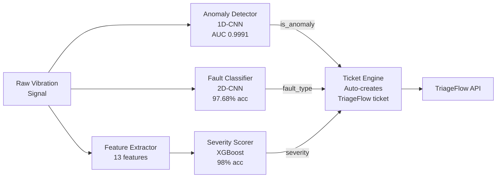

# TriageFlow — Industrial Maintenance AI Platform

<div align="center">


**An end-to-end agentic AI platform for industrial equipment maintenance.**
Sensor data → Anomaly detection → Auto ticket → AI recommendation → Human review.

[Demo](#demo) • [Architecture](#architecture) • [Quick Start](#quick-start) • [Models](#ml-models) • [API](#api-reference)

</div>

---

## What is TriageFlow?

Imagine a large oil and gas facility like Aramco with hundreds of pumps, compressors, motors, and turbines running 24/7. When something goes wrong, a technician writes a fault report — a **maintenance ticket**. A supervisor then has to:

1. Decide how urgent it is
2. Find the right procedure in thick maintenance manuals
3. Check if spare parts are available
4. Write a recommended action plan

At scale, this doesn't work. TriageFlow automates steps 1–4 using AI, while keeping the human supervisor in control of the final decision.

> **TriageFlow = Predictive Sensors + Agentic AI + Human-in-the-Loop**

---

## Demo

```
Sensor detects bearing fault
         ↓
AI pipeline runs automatically (3-8 seconds)
         ↓
Supervisor sees: "Inner Race Fault on P-204, Medium severity.
                  Recommended: Schedule bearing inspection within 48 hours.
                  Parts available. Lead time: 2 days.
                  Source: TF-MAN-001 Section 1.2.2"
         ↓
Supervisor clicks: Approve ✓
         ↓
Ticket closed with full audit trail
```

---

## Architecture

### System Overview



### LangGraph Workflow



### ML Model Pipeline



---

## Project Structure

```
triageflow/
├── backend/                        # FastAPI backend
│   ├── agents/
│   │   ├── classifier_agent.py     # LLM classification node
│   │   ├── drafting_agent.py       # LLM recommendation generation
│   │   ├── inventory_agent.py      # Spare parts lookup
│   │   └── retrieval_agent.py      # RAG retrieval node
│   ├── api/
│   │   ├── main.py                 # FastAPI app + CORS + lifespan
│   │   └── routes/
│   │       ├── tickets.py          # Ticket CRUD + graph invocation
│   │       └── sensors.py          # Sensor analysis endpoints
│   ├── db/
│   │   ├── models.py               # SQLAlchemy ORM models
│   │   └── session.py              # DB engine + get_db()
│   ├── graphs/
│   │   ├── state.py                # TicketState TypedDict
│   │   └── triage_graph.py         # LangGraph assembly
│   └── services/
│       ├── llm_client.py           # Groq LLM wrapper
│       ├── safety_rules.py         # Deterministic safety overrides
│       └── vector_store.py         # ChromaDB + fastembed wrapper
│
├── predictive/                     # ML pipeline (Project B)
│   ├── models/
│   │   ├── anomaly_detector.py     # 1D-CNN binary classifier
│   │   ├── fault_classifier.py     # 2D-CNN spectrogram classifier
│   │   ├── feature_extractor.py    # 13 time+frequency features
│   │   ├── rul_predictor.py        # CNN-BiLSTM + attention
│   │   └── severity_scorer.py      # XGBoost severity wrapper
│   ├── saved_models/
│   │   ├── anomaly_detector_supervised.pt
│   │   ├── cwru_fault_classifier.pt
│   │   ├── rul_cnn_bilstm.pt
│   │   └── severity_xgboost.pkl
│   ├── pipeline.py                 # Unified inference pipeline
│   ├── monitor.py                  # Real-time sensor replay
│   ├── generate_synthetic_data.py  # Synthetic IMS data generator
│   └── retrain_severity.py         # Local severity model retrainer
│
├── frontend/                       # Plain HTML/CSS/JS UI
│   ├── index.html                  # Submit ticket page
│   ├── review.html                 # Human review queue
│   ├── dashboard.html              # Sensor monitoring dashboard
│   ├── style.css                   # Industrial dark navy + orange theme
│   ├── api.js                      # Centralized fetch() wrapper
│   ├── app.js                      # UI logic
│   └── sensor_monitor.js           # Dashboard live update logic
│
├── data/
│   ├── manuals/
│   │   └── TriageFlow_Equipment_Manual.pdf   # 22-page RAG knowledge base
│   └── extracted/
│       └── ims/                    # IMS bearing dataset (or synthetic)
│
├── deployment/
│   ├── Dockerfile                  # Backend container
│   └── docker-compose.yml          # Full stack orchestration
│
├── .github/
│   └── workflows/
│       └── ci.yml                  # Lint → Test → Build → Deploy
│
├── .env                            # API keys (never commit)
├── .env.example                    # Template
└── requirements.txt
```

---

## ML Models

All four models trained from scratch on real industrial datasets.

### Model 1: Anomaly Detector

| Property | Value |
|---|---|
| Architecture | Supervised 1D-CNN Binary Classifier |
| Dataset | NASA IMS Bearing (25,120 windows) |
| Test AUC | **0.9991** |
| Threshold | 0.0039 |
| Input | 2048-sample raw vibration window |
| Output | Probability of fault (0–1) |

Why supervised instead of autoencoder: after 3 autoencoder attempts all scored AUC ≈ 0.44–0.51 (random), we switched to supervised learning since IMS healthy/faulty signals overlap too much in reconstruction error space. The supervised approach achieved AUC 0.9991.

### Model 2: Fault Classifier

| Property | Value |
|---|---|
| Architecture | 2D-CNN on 32×32 spectrograms |
| Dataset | CWRU Bearing (4,600 samples, 10 classes) |
| Test Accuracy | **97.68%** (with Test-Time Augmentation) |
| Classes | Ball_007/014/021, IR_007/014/021, Normal, OR_007/014/021 |
| Input | 32×32 vibration spectrogram |
| Output | Fault type + confidence |

### Model 3: RUL Predictor

| Property | Value |
|---|---|
| Architecture | CNN-BiLSTM with Attention |
| Dataset | NASA C-MAPSS FD001 (20,631 cycles, 100 engines) |
| Test RMSE | **17.8 cycles** (on 0–125 range) |
| Test MAE | 12.7 cycles |
| Input | 30-cycle sliding window, 14 sensors |
| Output | Remaining Useful Life in cycles |

### Model 4: Severity Scorer

| Property | Value |
|---|---|
| Architecture | XGBoost Classifier |
| Dataset | Combined features (6,000 samples) |
| Test Accuracy | **98–99%** |
| Classes | Low / Medium / High / Critical |
| Input | 13 time+frequency features |
| Output | Severity label |

---

## Equipment Coverage

The RAG knowledge base (`TF-MAN-001`) covers 15 equipment types across 8 categories matching real Aramco/NEOM facility equipment:

| Section | Equipment | IDs |
|---|---|---|
| 1 | Centrifugal Pumps | P-204, P-207, P-318 |
| 2 | Compressors | C-11, C-22, C-305 |
| 3 | Electric Motors | M-18, M-44, M-091 |
| 4 | Turbines | T-501, T-512 |
| 5 | Valves & Relief Systems | V-118, V-203 |
| 6 | Heat Exchangers | HX-77, HX-88 |
| 7 | Electrical Switchgear | MCC-14, SW-29 |
| 8 | Safety Override Reference | — |

---

## Key Design Decisions

### 1. Why LangGraph instead of a simple chain?

LangGraph's `interrupt()` function lets the graph **pause mid-execution** and survive server restarts (via SqliteSaver checkpointing). This means a ticket can be created, the server can restart, and the supervisor can still approve it hours later. A simple LangChain chain or custom polling loop would lose all state on restart.

### 2. Why deterministic safety rules, not just LLM judgment?

The `SafetyOverride` class in `safety_rules.py` is completely independent of the LLM. If a ticket mentions "gas leak", "fire", "H2S", or "explosion", it is **always** classified Critical regardless of what the LLM says. This is how real industrial AI deployments work — safety-critical decisions cannot rely on a model that might hallucinate.

### 3. Why fastembed instead of sentence-transformers?

`sentence-transformers` pulls in the full PyTorch stack as a dependency, making the Docker image 8–12GB. `fastembed` uses ONNX runtime instead and achieves the same embedding quality in ~200MB. This was the single biggest Docker optimization in the project.

### 4. Why supervised anomaly detection instead of autoencoder?

Three autoencoder attempts all scored AUC ≈ 0.44–0.51 on IMS bearing data. The root cause: IMS healthy and faulty signals have nearly identical reconstruction errors because bearing degradation is gradual, not sudden. With clear binary labels available, supervised learning is the correct tool. The supervised 1D-CNN achieved AUC 0.9991.

---

## Quick Start

### Prerequisites

- Python 3.11+
- Groq API key (free at [console.groq.com](https://console.groq.com))

### 1. Clone and install

```bash
git clone https://github.com/YOUR_USERNAME/triageflow.git
cd triageflow
python -m venv .venv
.venv\Scripts\activate        # Windows
# source .venv/bin/activate   # Mac/Linux
pip install -r requirements.txt
pip install -r predictive/requirements.txt
```

### 2. Configure environment

```bash
cp .env.example .env
# Edit .env and add your GROQ_API_KEY
```

### 3. Generate synthetic sensor data

```bash
python -m predictive.generate_synthetic_data
```

### 4. Start the backend

```bash
uvicorn backend.api.main:app --reload --port 8000
```

### 5. Start the frontend

```bash
cd frontend
python -m http.server 5500
```

### 6. Open the application

| Page | URL |
|---|---|
| Submit Ticket | http://localhost:5500/index.html |
| Review Queue | http://localhost:5500/review.html |
| Sensor Dashboard | http://localhost:5500/dashboard.html |
| API Docs | http://localhost:8000/docs |

### 7. Run sensor monitor (optional)

```bash
python -m predictive.monitor \
    --data-dir data/extracted/ims/1st_test/1st_test \
    --equipment-id P-204 \
    --api-url http://localhost:8000 \
    --delay 0.3
```

---

## Docker Deployment

```bash
# Build and start all containers
docker-compose -f deployment/docker-compose.yml up -d

# Check status
docker-compose -f deployment/docker-compose.yml ps

# View logs
docker-compose -f deployment/docker-compose.yml logs -f backend
```

Access at `http://localhost:8080`

---

## API Reference

### Tickets

| Method | Endpoint | Description |
|---|---|---|
| `POST` | `/tickets/` | Submit new ticket, starts graph |
| `GET` | `/tickets/` | List tickets by status |
| `GET` | `/tickets/history` | Get closed tickets |
| `GET` | `/tickets/{id}` | Get ticket state |
| `POST` | `/tickets/{id}/decision` | Approve/Edit/Reject |
| `GET` | `/tickets/{id}/audit-log` | Full audit trail |

### Sensors

| Method | Endpoint | Description |
|---|---|---|
| `POST` | `/sensors/analyze` | Analyze raw signal through ML pipeline |
| `GET` | `/sensors/status` | Check pipeline health |
| `POST` | `/sensors/simulate` | Run synthetic signal test |

### Health

| Method | Endpoint | Description |
|---|---|---|
| `GET` | `/health` | API health check |

---

## Tech Stack

| Layer | Technology | Why |
|---|---|---|
| LLM | Groq (Llama-3.3-70B) | Fast inference, free tier |
| Orchestration | LangGraph | Stateful, interruptible graph execution |
| RAG | ChromaDB + fastembed | Lightweight, no PyTorch dependency |
| Anomaly Detection | 1D-CNN (PyTorch) | AUC 0.9991 on IMS dataset |
| Fault Classification | 2D-CNN (PyTorch) | 97.68% on CWRU dataset |
| RUL Prediction | CNN-BiLSTM (PyTorch) | RMSE 17.8 cycles on C-MAPSS |
| Severity Scoring | XGBoost | 98% accuracy, CPU-fast |
| Backend | FastAPI | Async, auto-docs, dependency injection |
| Database | SQLite + SQLAlchemy | Zero-config, file-based persistence |
| Graph Checkpointing | SqliteSaver | Survives server restarts |
| Frontend | HTML/CSS/JS | No build step, easy to demo |
| Containerization | Docker + Compose | Reproducible deployment |
| CI/CD | GitHub Actions | Lint → Test → Build on every push |

---

## Dataset Credits

Models trained on publicly available industrial datasets:

- **CWRU Bearing Dataset** — Case Western Reserve University
- **NASA IMS Bearing Dataset** — NASA Prognostics Center of Excellence
- **NASA C-MAPSS** — NASA Turbofan Engine Degradation Simulation
- **Paderborn University KAt Bearing Dataset** — University of Paderborn

---

## Target Market

This project is designed specifically for the Saudi Arabian industrial AI market:

- **Saudi Aramco** — World's largest oil producer, runs thousands of pumps, compressors, and turbines
- **HUMAIN** — Saudi AI national company, building industrial AI infrastructure
- **NEOM** — Smart city project requiring industrial IoT and predictive maintenance
- **SDAIA** — Saudi Data and AI Authority, national AI strategy implementation
- **STC** and **Mozn** — Major Saudi tech companies with industrial AI divisions

The equipment categories, terminology, and fault scenarios in the knowledge base are modeled on real Aramco facility equipment classifications.

---

## What I Built and Why It Matters

This project demonstrates:

1. **Production-grade agentic AI** — not just calling an LLM, but a full stateful graph with interrupts, checkpointing, and human-in-the-loop control
2. **Real ML engineering** — 4 models trained from scratch on real industrial datasets, not pretrained model wrappers
3. **Safety-first design** — deterministic safety overrides that no LLM can circumvent
4. **Full-stack delivery** — from raw sensor signal to supervisor dashboard in one coherent system
5. **Industrial domain knowledge** — equipment terminology, fault signatures, and escalation logic that matches real facility operations

---

## License

MIT License — see [LICENSE](LICENSE) for details.

---

## Author

**Adnan Khan**
Software Engineer → AI/ML Engineer
Building for Aramco, HUMAIN, NEOM, SDAIA

*"The goal was never to build a chatbot. The goal was to build an AI system that a real maintenance supervisor at a real industrial facility could trust with real equipment decisions."*